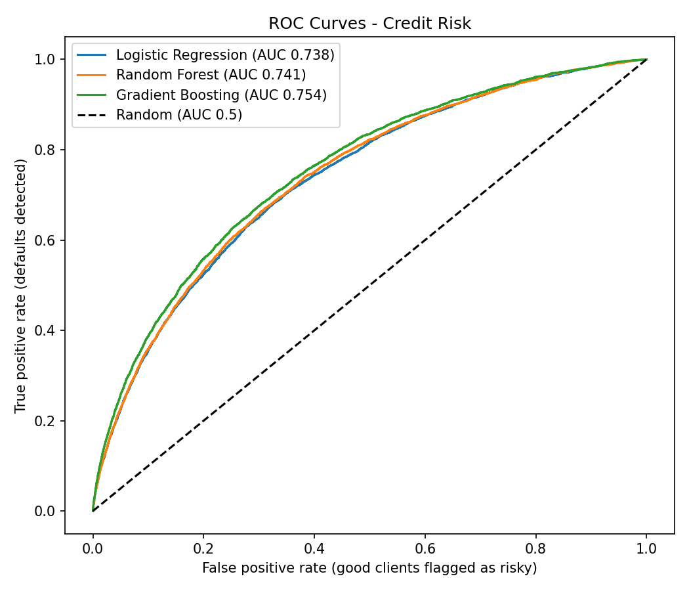
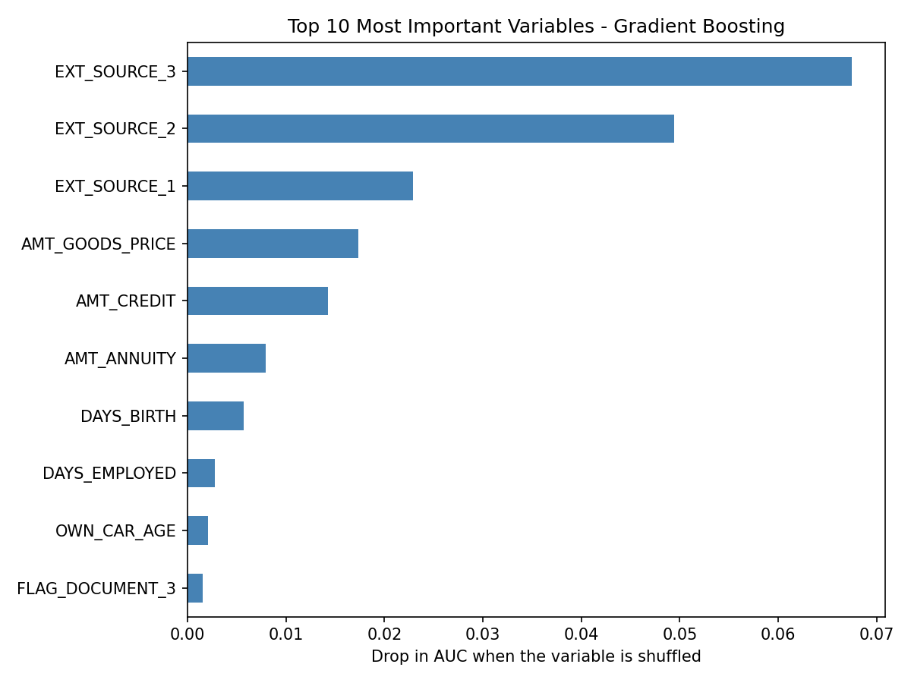

# Credit Risk Analysis — Home Credit Default Risk


## Overview

End-to-end credit risk analysis project using real-world loan application data
from Home Credit. The goal is to identify behavioral and financial patterns
associated with a higher risk of default, translate those findings into
actionable business recommendations, and build **predictive models** that score
each applicant's risk.

The project has two parts:

1. **Exploratory analysis** (SQL + Python + Power BI) in `credit-risk-analysis.ipynb`
2. **Predictive modeling** (scikit-learn) in `credit-risk-model.ipynb`

---

## Business Problem

A financial institution wants to understand **which client profiles are most
likely to default** on their loans, in order to:

- Improve their credit scoring model
- Adjust loan terms based on risk profile
- Reduce overall default rate (currently above industry average)

---

## Key Findings

| Finding                                      | Insight                                                  |
| -------------------------------------------- | -------------------------------------------------------- |
| Default rate: **8.07%**                      | Above industry average of 5-7%                           |
| Low Income fee/income ratio: **24%**         | vs 13.6% for High Income clients                         |
| Low-skill Laborers default rate: **17.2%**   | More than 2x the overall average                         |
| High bureau inquiries default rate: **9.3%** | 30% higher than clients with no inquiries                |
| Linear correlations with TARGET              | All near zero → default is multivariable                 |
| Best model ROC-AUC: **0.754**                | Gradient Boosting; Logistic Regression reaches 0.738     |
| Most predictive variables                    | External credit scores and loan amount / installment size |

---

## Project Structure

### Block 1 — Exploratory Data Analysis

- Dataset structure: 307,511 rows × 122 columns
- 67 columns with missing values identified and flagged
- Target variable analysis: highly imbalanced (91.9% vs 8.1%)
- Key data quality issues: sentinel values, extreme outliers

### Block 2 — Client Segmentation with SQL

- Income segmentation using `CASE WHEN`
- Financial profile by default status
- Default rate by contract type (Cash vs Revolving loans)
- Fee-to-income ratio analysis by segment

### Block 3 — Advanced SQL: Window Functions & CTEs

- Credit bureau inquiry patterns using CTEs
- Top 10 riskiest occupations using `RANK()` window function
- Behavioral signals associated with default risk

### Block 4 — Data Visualization

- Income segment risk analysis (bar charts)
- Correlation matrix of key risk variables (heatmap)
- Top 10 riskiest occupations with benchmark line

### Block 5 — Conclusions & Business Recommendations

- 5 key findings with actionable recommendations
- Since the linear correlations with default are near zero, a multivariate scoring model is built in Block 6

### Block 6 — Predictive Modeling (`credit-risk-model.ipynb`)

- Stratified 80/20 train/test split that preserves the 92/8 class proportion
- Three models compared: Logistic Regression, Random Forest and Gradient Boosting
- Class imbalance handled with `class_weight`; evaluation with ROC-AUC, recall and precision on the default class
- Variable importance computed with permutation importance

---

## Predictive Modeling

Only **8.07%** of clients default, so accuracy is misleading: a model that predicts
"nobody defaults" would be 92% accurate and useless. Models are therefore evaluated with
**ROC-AUC** and with **recall and precision on the default class**.

### Setup

- **Data:** `application_train.csv`, numeric variables only (first version)
- **Split:** 80% train (246,008 clients) / 20% test (61,503 clients), stratified, `random_state=42`
- **Preprocessing:** median imputation (and scaling for Logistic Regression), inside a pipeline so it is learned only from training data
- **Imbalance:** `class_weight='balanced'`

### Results

| Model               | ROC-AUC | Recall (default) | Precision (default) |
| ------------------- | ------- | ---------------- | ------------------- |
| Logistic Regression | 0.738   | 0.67             | 0.16                |
| Random Forest       | 0.741   | 0.51             | 0.19                |
| Gradient Boosting   | 0.754   | —                | —                   |

- The three models perform similarly; Gradient Boosting is slightly better. The simple Logistic Regression is competitive.
- A precision of 0.16 may look low, but the base default rate is 8%: **clients flagged by the model default about twice as often as the average client**.
- Differences in recall and precision between models depend largely on the decision threshold, which in practice should be chosen from the relative cost of approving a defaulter versus rejecting a good client.



### What drives the model



- **`EXT_SOURCE_1`, `EXT_SOURCE_2`, `EXT_SOURCE_3`** dominate: normalized scores from external credit information sources.
- **`AMT_GOODS_PRICE`, `AMT_CREDIT`, `AMT_ANNUITY`** come next, consistent with the exploratory finding that payment burden relative to income matters.
- **Age and employment length** contribute little. Age is a sensitive variable in credit scoring, so its use would need regulatory review in a real setting.

### Limitations and next steps

- Single train/test split; no cross-validation or hyperparameter tuning
- Only numeric variables; categorical variables are not used
- Auxiliary tables (`bureau`, `previous_application`, payment history) are not used yet
- Next: add categorical and engineered features (such as installment-to-income ratio), aggregate bureau and previous-application data, tune with cross-validation, calibrate probabilities and choose the threshold with a cost-benefit analysis

---

## Tools & Technologies

| Tool                     | Usage                                                  |
| ------------------------ | ------------------------------------------------------ |
| **SQL (SQLite)**         | Data exploration, segmentation, CTEs, window functions |
| **Python (Pandas)**      | Data wrangling, EDA, feature engineering               |
| **scikit-learn**         | Classification models, pipelines, evaluation           |
| **Matplotlib / Seaborn** | Statistical visualizations                             |
| **Power BI**             | Interactive executive dashboard                        |

---

## Repository Structure

```
credit-risk-analysis/
├── credit-risk-analysis.ipynb   ← Exploratory analysis (SQL + Python)
├── credit-risk-model.ipynb      ← Predictive modeling (scikit-learn)
├── credit_risk_analysis.pbix    ← Power BI dashboard
├── roc_curves.png               ← ROC curves of the three models
├── feature_importance.png       ← Permutation importance
└── README.md
```

The dataset (`application_train.csv`) is not included because of its size; download it from Kaggle (link below) and place it in a `data/` folder to run the modeling notebook.

---

## Power BI Dashboard

The interactive dashboard has two pages:

**Page 1 — Overview**

- KPI cards: Total Clients, Default Rate, Avg Fee to Income
- Default rate by income segment
- Payment burden by income segment
- Default vs No Default distribution

**Page 2 — Behavioral Risk Signals**

- Top 10 riskiest occupations (conditional formatting)
- Default rate by credit bureau inquiry level

> Download the `.pbix` file and open with Power BI Desktop (free) to explore the interactive dashboard.

---

## Links

- [Kaggle Notebook](https://www.kaggle.com/code/estefaniamarcel/credit-risk-analysis)
- Dataset: [Home Credit Default Risk](https://www.kaggle.com/competitions/home-credit-default-risk)

---

## Author

**Estefania Marcel** — Astronomy student transitioning into Data Science
Focused on banking, finance and credit risk analytics.
